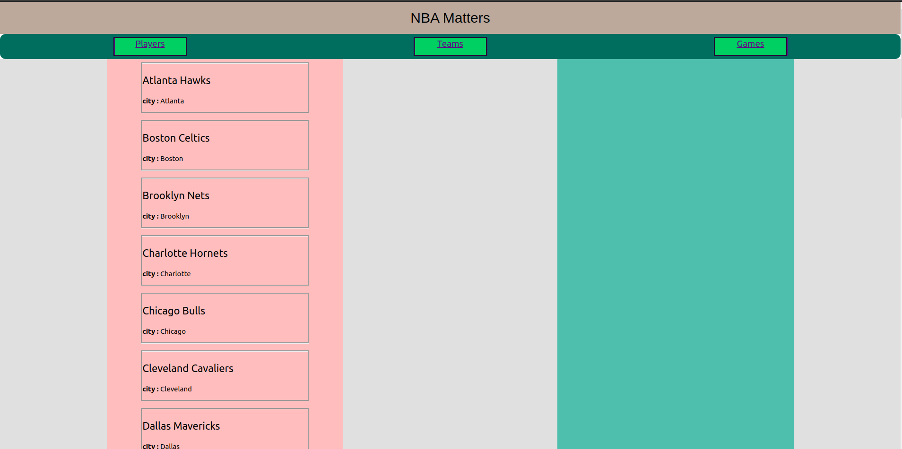

# NBA Matters

### Table of Content
- [NBA Matters](#nba-matters)
    - [Table of Content](#table-of-content)
  - [Project Description](#project-description)
    - [User Operations](#user-operations)
      - [project preview](#project-preview)
  - [Languages and Frameworks](#languages-and-frameworks)
  - [Setup Instructions](#setup-instructions)
  - [Link to Live Site](#link-to-live-site)
  - [Author](#author)

## Project Description
----------
NBA Matters is your full on store for information concerning basketball. It contains informtion starting from players in the NBA to matches scheduled to be played. There is also teams which provide vast information. The application is user friendly and easy to interact with.

### User Operations
----------
- View a list of NBA players
- View a list of teams
- View stats for available matches
- View a single player's details
- view a single team's details
- View a list of available matches

#### project preview

List of NBA players

List of teams

List of matches

details of match

## Languages and Frameworks
----------
- Html
- JavaScript
- React Js

## Setup Instructions
----------
**ensure you have npm installed** else [click here](https://docs.npmjs.com/downloading-and-installing-node-js-and-npm) to download and install npm and node.js
To get the project working, perform the following steps;
  1. Clone this repository to your machine
    - run `git clone [url]` passing the url or ssh provided by github
  2. run `npm install` then `npm start` to start the application
  3. run `npm run watch` to start the json-server

## Link to Live Site
https://main--papaya-daifuku-0537c9.netlify.app/

## Author
[George Samuel](https://www.linkedin.com/in/george-samuel-504125222)
 
